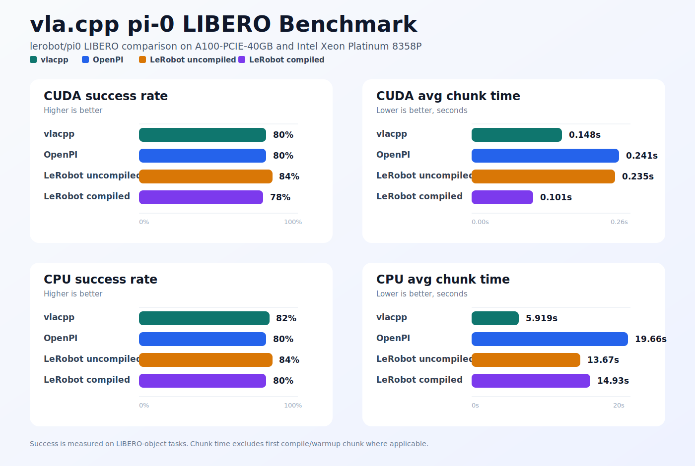

# vla.cpp

> [!CAUTION]
> This may not be the best timing to build a C++ runtime for VLA/WMA models.
> The embodied AI space is moving extremely fast, with new models showing up
> almost every day, so maintaining many model implementations in C++ is probably
> not realistic.
>
> More importantly, from an edge-device perspective, this project is honestly
> pretty **_useless_** for now. On GPU devices like Jetson Thor, the speedup over
> `torch.compile` is not very obvious. On CPU, `vla.cpp` can be around 3x faster,
> but it is still far from real-time. Also, common deployment tricks like
> aggressive quantization are not always acceptable here, since they may hurt
> action quality.
>
> So yeah, I am mostly writing `vla.cpp` for learning, for fun, and maybe for
> some kind of future vision. Hopefully one day the VLA/WMA era will hit its
> “ChatGPT moment”, CPUs / edge accelerators will become much stronger, and this
> project will become actually useful. A small wish.

`vla.cpp` is a C++ VLA runtime for π0-style GGUF inference, built on top of
`llama.cpp` / `ggml`. The v1 scope currently focuses on π0-style models and
includes GGUF conversion , a π0 CLI, and focused runtime tests.

I may add more classic / representative VLA models, such as π0.5 and OpenVLA, in the future, _or maybe not_.



## Layout

- `include/vlacpp.h`: public C ABI.
- `python/vlacpp`: Python API wrapping the C ABI.
- `src/core`: context lifecycle, GGUF/JSON metadata, preprocessing, errors.
- `src/models`: model dispatch and shared model runtime helpers.
- `src/models/pi0`: pi0 prefix/cache helpers, tokenizer, and action decoding.
- `src/sampling`: flow sampler.
- `examples/pi0-cli`: minimal command-line inference example.
- `tools`: GGUF conversion, tensor mapping, and inspection utilities.
- `eval`: optional LIBERO simulator evaluation flow.
- `tests`: CTest-registered C++ and Python smoke/parity tests.
- `reports`: benchmark notes for release claims.

Generated build directories, checkpoints, artifacts, and datasets should stay
out of git under `build*/`, `ckpts/`, `artifacts/`, and `data/`.

## Build And Test

CPU build:

```sh
git submodule update --init --recursive
cmake -S . -B build
cmake --build build
ctest --test-dir build --output-on-failure
```

CUDA build:

```sh
git submodule update --init --recursive
cmake -S . -B build-cuda \
  -DGGML_CUDA=ON \
  -DCMAKE_CUDA_ARCHITECTURES=80
cmake --build build-cuda -j
ctest --test-dir build-cuda --output-on-failure
```

Set `CMAKE_CUDA_ARCHITECTURES` for your GPU. Common values are `80` for A100,
`86` for RTX 30xx/A10, `89` for RTX 40xx/L40, and `90` for H100. The Python
wrapper can load the CUDA build with `library_path="build-cuda/libvlacpp.so"`.

## pi0 LIBERO GGUF Flow

The runtime loads GGUF models. Set `MODEL_DIR` to a local pi0 LIBERO checkpoint
directory containing `model.safetensors` and `config.json`:

```sh
MODEL_DIR=/path/to/pi0-libero
mkdir -p artifacts
```

Map LeRobot/OpenPI tensor names to vlacpp runtime names:

```sh
python3 tools/map-openpi-tensors.py "$MODEL_DIR/model.safetensors" \
  --family pi0-full \
  --include-inventory \
  --output artifacts/pi0-libero-map.json
```

Write GGUF:

```sh
python3 tools/convert-openpi-to-gguf.py \
  --tensor-map-manifest artifacts/pi0-libero-map.json \
  --config "$MODEL_DIR/config.json" \
  --output artifacts/pi0-libero.gguf \
  --model-type pi0 \
  --action-horizon 50 \
  --state-dim 32 \
  --action-dim 32 \
  --image-width 224 \
  --image-height 224
```

Inspect the result:

```sh
python3 tools/inspect-gguf.py artifacts/pi0-libero.gguf --contains vlacpp.openpi
./build/vlacpp-pi0 --model artifacts/pi0-libero.gguf --info
```

Run local inference:

```sh
./build/vlacpp-pi0 \
  --model artifacts/pi0-libero.gguf \
  --state "$(python3 -c 'print(",".join(["0"] * 32))')" \
  --prompt "pick up the fork" \
  --steps 10 \
  --seed 1
```

This should report `horizon: 50`, `action_dim: 32`, and a 50x32 action chunk.
For simulator rollouts, see `eval/README.md`.

## C Interface

Use the ABI in `include/vlacpp.h`. The basic lifecycle is:

1. `vlacpp_load_model`
2. `vlacpp_create_context`
3. `vlacpp_infer_actions`
4. `vlacpp_free_action_chunk`
5. `vlacpp_free_context` / `vlacpp_free_model`

Call `vlacpp_reset_cache` whenever the visual/text prefix changes.

## Python Interface

```python
import numpy as np
import vlacpp

policy = vlacpp.Pi0Policy(
    "artifacts/pi0-libero.gguf",
    library_path="build/libvlacpp.so",
    backend=vlacpp.VLACPP_BACKEND_CPU,
    seed=1000,
    flow_steps=10,
)

actions = policy.infer(
    state=np.zeros(32, dtype=np.float32),
    images={
        "base_0_rgb": np.zeros((256, 256, 3), dtype=np.uint8),
        "left_wrist_0_rgb": np.zeros((256, 256, 3), dtype=np.uint8),
    },
    prompt="pick up the tomato sauce and place it in the basket\n",
)
policy.close()
```

The wrapper returns an `H x action_dim` `float32` NumPy array.
